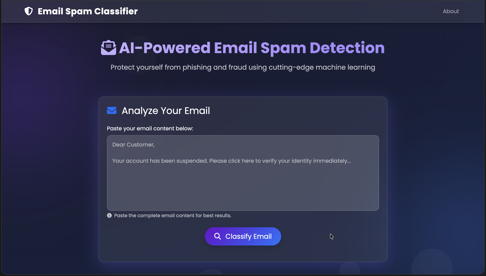
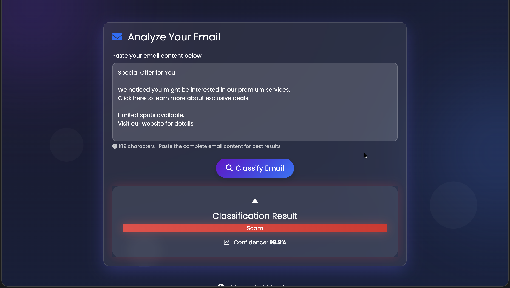
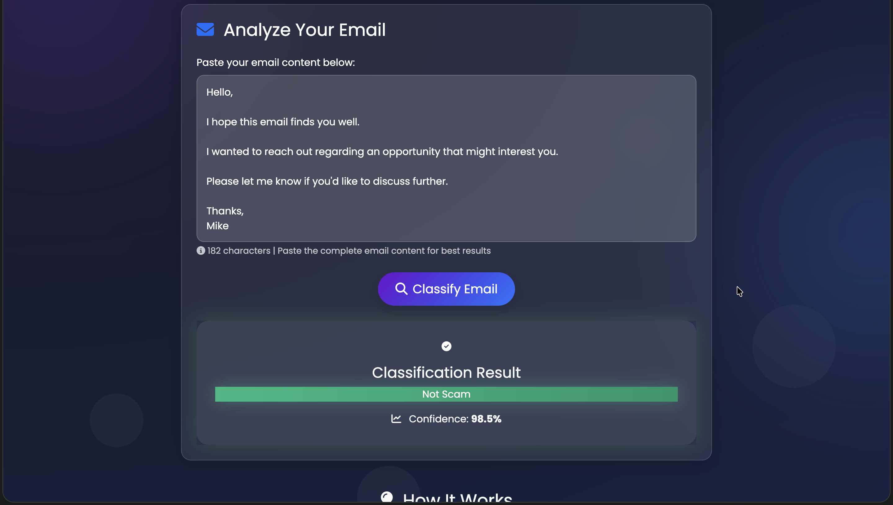

# 📧 Email Scam Classifier

An AI-powered web application that detects spam and phishing emails using Machine Learning. Built with Flask and scikit-learn, featuring a modern, animated UI.


---

🌍 **Live Demo:**  
[](https://email-spam-classifier-7pct.onrender.com/)


## 🌟 Features

- ✅ **Real-time Email Classification** - Instant spam/scam detection
- 🎯 **High Accuracy** - Trained on 10,000+ emails with 98%+ accuracy
- 💯 **Confidence Scores** - Shows prediction confidence percentage
- 🎨 **Modern UI** - Beautiful glassmorphism design with smooth animations
- 🚀 **Fast Response** - Predictions in under 1 second
- 📱 **Responsive Design** - Works on desktop, tablet, and mobile
- 🔒 **Privacy-Focused** - No data stored, all processing done locally

## 🖼️ Screenshots

### Main Interface


### Spam Detection


### Safe Email Detection


## 🛠️ Tech Stack

**Backend:**
- Flask 3.0.0
- scikit-learn 1.7.2
- joblib 1.4.2
- Python 3.12

**Frontend:**
- HTML5, CSS3, JavaScript (ES6+)
- Bootstrap 5.3.0
- Animate.css 4.1.1
- Font Awesome 6.4.0

**Machine Learning:**
- Naive Bayes Classifier (MultinomialNB)
- TF-IDF Vectorization
- Custom Email Preprocessing Pipeline

## 📊 Model Performance

- **Accuracy:** 98.28%
- **Precision (Spam):** 98.92%
- **Recall (Spam):** 96.18%
- **F1-Score:** 97.53%
- **Dataset Size:** 10,751 emails
- **Training/Test Split:** 80/20

## 🚀 Quick Start

### Prerequisites

- Python 3.11 or 3.12
- pip package manager
- Virtual environment (recommended)

### Installation

1. **Clone the repository**
```bash
git clone https://github.com/Rishu22889/email_spam_classifier.git
cd email_spam_classifier
```

2. **Create and activate virtual environment**
```bash
# On macOS/Linux
python3 -m venv venv
source venv/bin/activate

# On Windows
python -m venv venv
venv\Scripts\activate
```

3. **Install dependencies**
```bash
pip install -r requirements.txt
```

4. **Run the application**
```bash
python app.py
```

5. **Open your browser**
```
http://127.0.0.1:5000
```

## 📁 Project Structure

```
email-scam-classifier/
├── app.py                      # Flask application
├── model.py                    # ML model loader and predictor
├── preprocessor.py             # Email preprocessing class
├── pipe_nb.joblib              # Trained model (not in repo)
├── requirements.txt            # Python dependencies
├── README.md                   # This file
├── .gitignore                  # Git ignore rules
├── static/
│   ├── css/
│   │   └── style.css          # Custom styles
│   └── js/
│       └── main.js            # Frontend JavaScript
├── templates/
│   └── index.html             # Main webpage
└── screenshots/               # UI screenshots
    ├── main.png
    ├── spam-result.png
    └── safe-result.png
```

## 🧪 Testing

### Test with Sample Emails

**Spam Email Example:**
```
URGENT! Your account has been suspended!
Click here to verify your identity NOW: http://fake-bank.com
You won $10,000! Claim your prize immediately!
Act fast or lose access forever!
```

**Safe Email Example:**
```
Hi there,

Your order #12345 has been confirmed and will ship within 2-3 business days.

You can track your order in your account dashboard.

Best regards,
Customer Service Team
```

### Run Tests
```bash
# Test model directly
python model.py

# Expected output:
# ✅ Model loaded successfully
# ✅ Model is working correctly!
```

## 🔧 Configuration

### Model Configuration
Edit `model.py` to change model file path:
```python
MODEL_PATH = 'your_model_filename.joblib'
```

### Server Configuration
Edit `app.py` to change host/port:
```python
app.run(debug=True, host='127.0.0.1', port=5000)
```

## 📝 API Documentation

### POST /predict

Classify an email as spam or not spam.

**Request:**
```json
{
  "email_text": "Your email content here..."
}
```

**Response:**
```json
{
  "prediction": "Scam" | "Not Scam",
  "confidence": 0.96
}
```

### GET /health

Check if the application and model are running.

**Response:**
```json
{
  "status": "healthy",
  "model_loaded": true,
  "model_type": "Pipeline"
}
```

## 🚢 Deployment

### Deploy to Heroku

1. **Create Heroku account** at [heroku.com](https://heroku.com)

2. **Install Heroku CLI**
```bash
brew install heroku/brew/heroku  # macOS
```

3. **Login to Heroku**
```bash
heroku login
```

4. **Create Heroku app**
```bash
heroku create your-app-name
```

5. **Add Procfile**
```bash
echo "web: gunicorn app:app" > Procfile
```

6. **Update requirements.txt**
```bash
echo "gunicorn==21.2.0" >> requirements.txt
```

7. **Deploy**
```bash
git add .
git commit -m "Deploy to Heroku"
git push heroku main
```

8. **Open your app**
```bash
heroku open
```

### Deploy to Railway

1. **Create account** at [railway.app](https://railway.app)

2. **Install Railway CLI**
```bash
npm install -g @railway/cli
```

3. **Login and initialize**
```bash
railway login
railway init
```

4. **Deploy**
```bash
railway up
```

### Deploy to Render

1. **Create account** at [render.com](https://render.com)

2. **Connect GitHub repository**

3. **Create new Web Service**

4. **Configure:**
   - Build Command: `pip install -r requirements.txt`
   - Start Command: `gunicorn app:app`

5. **Deploy** - Automatic on git push!

### Deploy to PythonAnywhere

1. **Create account** at [pythonanywhere.com](https://www.pythonanywhere.com)

2. **Upload code** via Files tab

3. **Install dependencies** in Bash console:
```bash
pip install --user -r requirements.txt
```

4. **Configure Web app** in Web tab

5. **Reload** and access your app!

## 🤝 Contributing

Contributions are welcome! Please feel free to submit a Pull Request.

1. Fork the repository
2. Create your feature branch (`git checkout -b feature/AmazingFeature`)
3. Commit your changes (`git commit -m 'Add some AmazingFeature'`)
4. Push to the branch (`git push origin feature/AmazingFeature`)
5. Open a Pull Request

## 📄 License

This project is licensed under the MIT License - see the [LICENSE](LICENSE) file for details.

## 👨‍💻 Author

**Rishi Singh**
- GitHub: [@Rishu22889](https://github.com/Rishu22889)
- LinkedIn: [Rishi Singh](https://www.linkedin.com/in/risuraj/)
- Email: rk1258106@gmail.com

## 🙏 Acknowledgments

- Dataset from [SpamAssassin Public Corpus](https://spamassassin.apache.org/old/publiccorpus/)
- Inspired by email security and user protection
- Built with ❤️ for cybersecurity awareness

## 📞 Support

If you have any questions or issues, please:
1. Check the [Issues](https://github.com/Rishu22889/email_spam_classifier/issues) page
2. Create a new issue with detailed description
3. Contact via email

## 🔮 Future Enhancements

- [ ] Multi-language support
- [ ] Batch email processing
- [ ] Email attachment analysis
- [ ] Real-time email monitoring
- [ ] Browser extension
- [ ] Mobile app (iOS/Android)
- [ ] API rate limiting
- [ ] User accounts and history
- [ ] Advanced analytics dashboard
- [ ] Integration with email clients

## 📈 Changelog

### Version 1.0.0 (2024-10-18)
- Initial release
- Naive Bayes classifier with 98% accuracy
- Modern web interface
- Real-time predictions
- Confidence scoring

---

**⭐ If you find this project helpful, please give it a star!**

Made with 💻 and ☕ by Rishi Singh
